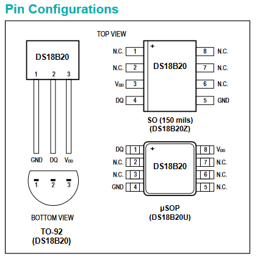
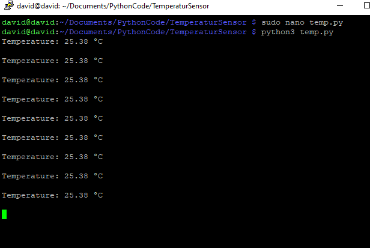
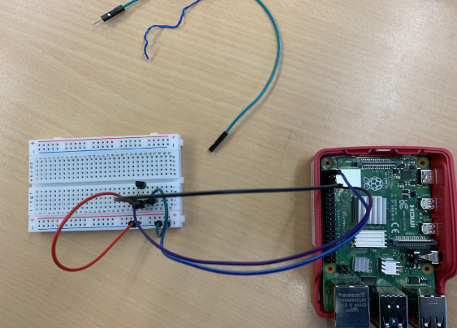

# TemperatureSensor
  

Small programe written in Python for recording the current room temperature using the DS18B20 Sensor

* Python3
* Linux/Rapsberry Pie
* IoT

## Frameworks

* os
* glob
* time

## Reference

## Screenshots

 
